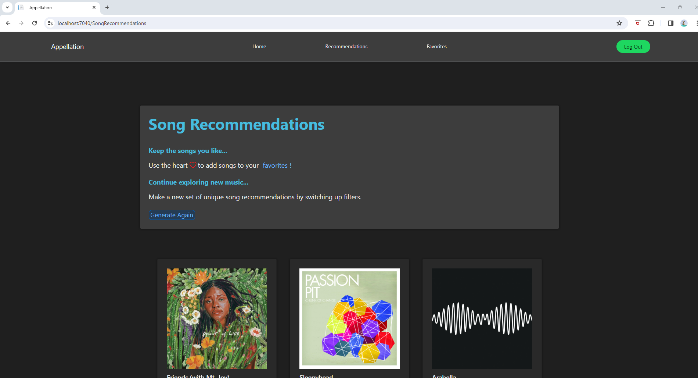

# Appellation Song Recommendations

Get fresh new music using Appelation, a song recommendation app that uses your preferences to curate a unique song list just for you.

## Features:

- Song Recommendations: Generate song recommendations based on your favorite artists, generes, and tracks.
  
- Previews: Listen to a sample of recommended tracks to see which ones you like.

- Favorites: Add songs you like to your favorites!

- Spotify API: Our app is powered by the Spotify API, ensuring a wide range of music is abailable.

- User-Friendly Interface: Intuitive design makes it easy for users to navigate the song generator seamlessly.

## Tour of the App:

### Log In Screen
Here users log in using their spotify credentials.


### Home Screen
After logging in, users are redirected to the home page.


### Song Generator
Here users can input artists, genres, and tracks they want to base their song recommendations off of. Users also have the option to choose wether the recommendations provided are "popular" or not,
which is determined based on the streams the track recieves on Spotify. Users have the ability to disable this feature if they would prefer to recieve recommendations with a mix of different popularities.


This image shows the song generator with input.


### Verification Page
Here users will verify thier input on the previous page. With Spotify being home to an immense amount of different artists, some songs and artists have the same names. That being said, in order to generate accurate
recommendations the user is required to verify their original input.


This image shows what verification looks like after selections are made. Here, the user selected the images corrisponding to the correct artist and track. The images not selected are dim while the selections are
slightly brighter. 


This image shows the bottom of the verification page which shows the genre, limit, and popularity settings.


###



## How to Use: 

### Cloning the repository
```
git clone https://github.com/andresaan/interactive-world-map.git
cd interactive-world-map
```
### Install dependencies
```
npm install
```
### Run the project
```
ng serve
```
Open http://localhost:4000